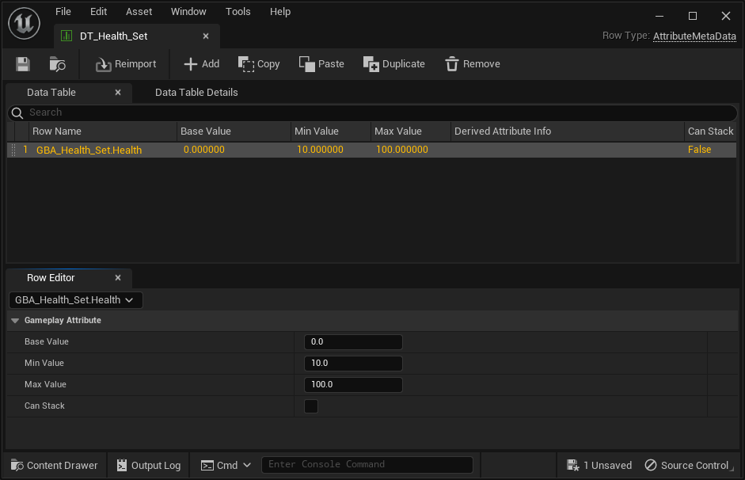
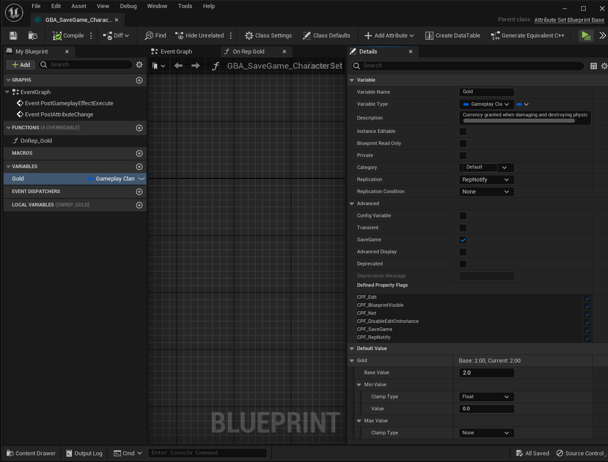

# Blueprint Attributes

Blueprint Attributes enables a workflow 100% within the Editor and Blueprints for Attribute Sets and Gameplay Attributes.

<div class="columns">
<div class="small pt-2">

- Define Attributes in Blueprint
- Interactions with Gameplay Effects
- MMC and Exec Class in Blueprint
- Built-in Clamping
- Save Game support and Serialization

</div>
<div class="small pt-2">

- Replication and Multiplayer
- Integration with K2 Nodes
- Wizard to port BP defined Attributes to C++
- Referencer Handlers

</div>
</div>

---

###### Quicker iterations

<div class="columns">
<div>

Quickly iterate on your Attribute Sets and Gameplay Attributes, directly from Blueprints.

</div>
<div>


</div>
</div>

---

<div class="columns">

<div class="blur p-0">

###### Quicker iterations

</div>

</div>

<div class="columns">

<div class="blur">


Quickly iterate on your Attribute Sets and Gameplay Attributes, directly from Blueprints.

</div>

</div>


---

<div class="columns">

<div class="blur-lg" style="padding: 0 0.5em 0.5em 0.5em;">

###### Quicker iterations

Create a new Blueprint Attribute Set from Content Browser.

</div>


</div>

---

<div class="blur-lg p-0" style="position: absolute; left: 0px; bottom: 0px; width: 100%; padding: 0 0.5em 0.5em 0.5em;">

###### Quicker iterations

Add any number of Attributes with a click of a button.

</div>


---

<div class="blur-lg p-0" style="position: absolute; left: 0px; bottom: 0px; width: 100%; padding: 0 0.5em 0.5em 0.5em;">

###### Interactions with Gameplay Effects

Use them right away within your Gameplay Effects.

</div>


---

<div class="blur-lg p-0" style="position: absolute; left: 0px; bottom: 0px; width: 100%; padding: 0 0.5em 0.5em 0.5em;">

###### Interactions with Gameplay Effects

Get access to `UAttributeSet` API, exposed to Blueprints as Events or overridable methods.

</div>


---

<div class="blur-lg p-0" style="position: absolute; left: 0px; bottom: 0px; width: 100%; padding: 0 0.5em 0.5em 0.5em;">

###### Set Base Value directly from Details Panel

Custom details customization to set Base Value (initial) from Blueprint Details.

</div>


---

<div class="blur-lg p-0" style="position: absolute; left: 0px; bottom: 0px; width: 100%; padding: 0 0.5em 0.5em 0.5em;">

###### Set Base Value directly from Details Panel

View and set Attribute details at once <span class="small" style="font-szize: 0.8rem;">*(with Class Defaults button selected in the toolbar)*</span>
</div>


---

<div class="blur-lg p-0" style="position: absolute; left: 0px; bottom: 0px; width: 100%; padding: 0 0.5em 0.5em 0.5em;">

###### Set Base Value directly from Details Panel

Custom details customization to set Base Value (initial) from Blueprint Details.

</div>


---

<div class="blur-lg p-0" style="position: absolute; left: 0px; bottom: 0px; width: 100%; padding: 0 0.5em 0.5em 0.5em;">

###### Built-in Clamping

<div style="font-size: 0.65em;">

Clamping of Gameplay Attributes is a really common pattern. It made sense to add native support for it.

You can do so from either:

- DataTables (AttributeMetaData)
  - Using Min and Max columns
- Or with a custom made Gameplay Attribute `FGBAGameplayClampedAttributeData`
  - Tweak clamping behavior from Details Panel
- Or manually using the exposed events on the Attribute Set itself
  - PostGameplayEffectExecute, PreAttributeChange / PreAttributeBaseChange, etc.

</div>

</div>




---

###### Built-in Clamping

<div style="font-size: 0.65em;">

Clamping of Gameplay Attributes is a really common pattern. It made sense to add native support for it.

You can do so from either:

- DataTables (AttributeMetaData)
  - Using Min and Max columns
- Or with a custom made Gameplay Attribute `FGBAGameplayClampedAttributeData`
  - Tweak clamping behavior from Details Panel
- Or manually using the exposed events on the Attribute Set itself
  - PostGameplayEffectExecute, PreAttributeChange / PreAttributeBaseChange, etc.

</div>


---

<div class="blur-lg p-0" style="position: absolute; left: 0px; bottom: 0px; width: 100%; padding: 0 0.5em 0.5em 0.5em;">

###### MMC and Execution Calculation 

MMC (Modifier Magnitude Calculation) and Exec Calc (Gameplay Effect Execution Calculation) support, implementable in Blueprints.

</div>


---

<div class="blur-lg p-0" style="position: absolute; left: 0px; bottom: 0px; width: 100%; padding: 0 0.5em 0.5em 0.5em;">

###### MMC (Modifier Magnitude Calculation)

<div class="small">

- *MMC implemented in Blueprint (or C++), working with BP defined Attributes.*
- *Fill in the Relevant Attributes to Capture in Class Defaults.*
- *Use the engine's built-in BP exposed methods directly from the engine class.*

<!-- <div style="font-size: 0.7em">

*Disclaimer: On engine 5.2 and lower, a slight workaround related to const correctness of methods is needed. Fixed in 5.3.*

</div> -->

</div>

</div>


---

<div class="blur-lg p-0" style="position: absolute; left: 0px; bottom: 0px; width: 100%; padding: 0 0.5em 0.5em 0.5em;">

###### Exec Calc (Gameplay Effect Execution Calculation)

<div class="small">

- *Exec calc implemented in Blueprint (or C++), working with BP defined Attributes.*
- *Fill in the Relevant Attributes to Capture in Class Defaults*

</div>

</div>


---

###### Exec Calc (Gameplay Effect Execution Calculation)

<div class="columns">
<div class="small" style="font-size: 0.7em;">

<!-- - *Natively, Exec Calc are implementable in BP but are missing important helpers to actually base the calculation in Blueprint.* -->

By default, Exec Calc are Blueprintable but are missing important BP exposed methods or helpers to actually base the entire calculation logic purely in Blueprint.


Blueprint Attributes defines a few Blueprint statics (eg. Blueprint Library globally accessible) to help in the implementation.

</div>
<div>


</div>
</div>

---

###### Exec Calc (Gameplay Effect Execution Calculation)

<div style="font-size: 0.7em;">

Those few custom methods were designed to help implementing Exec Calc classes in Blueprints, namely:

</div>

<div class="small" style="font-size: 0.65em;">

- GetOwningSpec()
- GetEffectContext()
- GetSourceTags()
- GetTargetTags()
- AttemptCalculateCapturedAttributeMagnitude()
- AttemptCalculateCapturedAttributeMagnitudeWithBase()
- AddOutputModifier()

*For `AttemptCalculateCapured...` methods to work correctly, the Attribute needs to be added to the Relevant Attributes to Capture array in Class Defaults.*

</div>

<div>


</div>

---

<div class="blur-lg p-0" style="position: absolute; left: 0px; bottom: 0px; width: 100%; padding: 0 0.5em 0.5em 0.5em;">

###### Exec Calc (Gameplay Effect Execution Calculation)

<div style="font-size: 0.65em;">

*For `AttemptCalculateCapured...` methods to work correctly, the Attribute needs to be added to the Relevant Attributes to Capture array in Class Defaults.*

</div>

</div>


---

<div class="blur-lg p-0" style="position: absolute; left: 0px; bottom: 0px; width: 100%; padding: 0 0.5em 0.5em 0.5em;">


###### Save Game

<div class="small" style="font-size: 0.65em;">

While Blueprint Attributes is not a Save Game framework, and save games are highly project specific, it was important to ensure BP defined GameplayAttributes are still serializable and support for Save Game is possible.

In the details panel, click the "Advanced" category, and enable the SaveGame flag by turning on the checkbox.

</div>

```cpp
// In C++:
UPROPERTY(BlueprintReadOnly, ReplicatedUsing = OnRep_Health, SaveGame)
FGameplayAttributeData Health = 0.f;
```

</div>



---

<div class="blur-lg p-0" style="position: absolute; left: 0px; bottom: 0px; width: 100%; padding: 0 0.5em 0.5em 0.5em;">


###### Save Game

<div class="small" style="font-size: 0.65em;">

Here's a basic flow of Save / Load to save the attributes on Ctrl+S, and load them back on Ctrl+L.

1. Have a SaveGame object with an Array of Bytes property.

</div>

</div>


---

<div class="blur-lg p-0" style="position: absolute; left: 0px; bottom: 0px; width: 100%; padding: 0 0.5em 0.5em 0.5em;">


###### Save Game

<div class="small" style="font-size: 0.65em;">

2. Pass down the binary data to `UGBASerializationBlueprintLibrary::SerializeAbilitySystemComponent()`
3. Make sure bIsSaving is turned on Save, and turned off on Load.

</div>

</div>


---

###### Credits

<div style="font-size: 0.7em;">

A special thank you, from the bottom of my heart, to the following individuals:

For early testing and providing valuable feedback

- Metaseven - thank you so much!

For supporting my rantings and doubts along the way while implementing this plugin (first commit in March 2022, 2 years!)

- OneSilverLeaf
- Mighteemouse

Thank you.

</div>

---


<!-- ## Quicker iterations

- Empower Game Designers and Blueprint Developers to quickly iterate on their Attribute design.

---

## Introduction

###### Features

1. **Quicker Iterations**
    - Empower Game Designers and Blueprint Developers to rapidly iterate on Attribute design.

---

## Introduction

###### Features

2. **Define Attributes in Blueprint**
    - Create Attribute property variables in the Blueprint Editor for immediate use in Gameplay Effects, K2 Nodes (e.g., GetFloatAttribute()), and other locations where a Gameplay Attribute picker is applicable.

---

3. **Built-in Clamping**
    - Support for clamping via Data Table initialization.
    - Handling of "Min Value" and "Max Value" columns.
    - Customizable clamping using a special Gameplay Clamped Attribute Data property (a child of FGameplayAttributeData) with float or Attribute-based clamping.

---

4. **Customized Blueprint Editor**
    - Blueprint Editor with Data Validation.
    - Toolbar with quick-access buttons for:
        - Adding Gameplay Attribute properties.
        - Creation of Data Tables.
        - Porting BP Attribute Sets to standard C++ Attribute Sets.
    - Details Customizations to expose Attribute BaseValue to Blueprint and set it directly from the Details panel.

---

5. **Interactions with Gameplay Effects**
    - Attribute Sets can override several functions to control how an Attribute responds when a Gameplay Effect attempts to modify it.
    - Most of this API is exposed to Blueprints (e.g., PostGameplayEffectExecute, Pre/PostAttributeChange).

---

6. **Replication**
    - Replication support for Gameplay Attributes defined in Blueprints, suitable for multiplayer projects.
    - Handling of LifetimeReplicatedProps.
    - Integration of rep notifies to manage predictively modified attributes by clients (equivalent to the C++ GAMEPLAYATTRIBUTE_REPNOTIFY macro).

---

7. **Integration with K2 Nodes**
    - K2 Nodes (Blueprint nodes) that use FGameplayAttribute parameters now display a list of Attributes defined in Blueprints in the combo box, similar to Gameplay Attribute properties in Gameplay Effects.

---

8. **Attribute Wizard for Blueprint to C++ Transition**
    - A wizard and Scaffold module facilitate the transition from Blueprint-defined Attributes to C++.
    - Generates proper C++ header and source files (with preview!) based on defined Gameplay Attributes in the BP Attribute Set.

---

9. **Referencer Handlers**
    - Detects Attribute renaming in the Blueprint Editor.
    - Offers to replace previous references to the renamed Attribute in Gameplay Effects.
    - Displays a list of modified properties and Blueprint nodes (K2Nodes) in the message log with clickable links for easy navigation to the referencers. -->